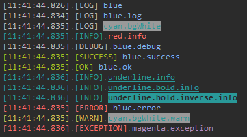
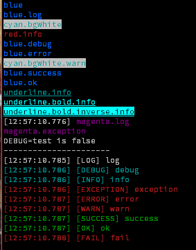

# debug-color2

    colorize console log, this module can work with require('debug')


1. same api with console
2. can work with [debug](https://www.npmjs.com/package/debug)



## demo

[API](lib/node.d.ts)

```ts
export interface IOptions
{
	/**
	 * enable log display or not
	 */
	enabled?: boolean,

	/**
	 * show label string
	 */
	label?: boolean | string[],

	/**
	 * show time label
	 */
	time?: boolean,

	/**
	 * set default inspectOptions
	 */
	inspectOptions?: util.InspectOptions,

	/**
	 * set color style
	 */
	colors?: {
		debug?,
		error?,
		info?,
		log?,
		trace?,
		warn?,
		success?,
		ok?,
		[k: string]: string | Chalk | IChalkLike,
	},

	/**
	 * check is node.js console
	 */
	readonly stream?: boolean,
}
```

```ts
import ConsoleColorize, { Console } from 'debug-color2';

let options = {
    time: true,
    label: true,
};

let c1;
c1 = new Console();
c1 = new Console(console);
c1 = new Console(console, options);

c1 = ConsoleColorize.console
```

```ts
let c1 = new Console2();

c1.blue('blue');
c1.blue.log('blue.log');

c1.cyan.bgWhite('cyan.bgWhite');

c1.red.info('red.info');

c1.blue.debug('blue.debug');
c1.blue.error('blue.error');
c1.cyan.bgWhite.warn('cyan.bgWhite.warn');

c1.blue.success('blue.success');
c1.blue.ok('blue.ok');
//
c1.underline.info('underline.info');
c1.underline.bold.info('underline.bold.info');
c1.underline.bold.inverse.info('underline.bold.inverse.info');

c1.magenta.withOptions({
	time: true,
}).log('magenta.log');

c1.magenta.exception('magenta.exception');

let c2 = c1.magenta.withOptions({
	enabled: debug('test').enabled
});

console.log('DEBUG=test is', debug('test').enabled);

c2.log('this show when DEBUG=test or DEBUG=*');

console.log('----------------------');

c1.setOptions({
	label: true,
	time: true,
});

c1.log('log');
c1.assert(true, 'assert');

c1.debug('debug');
c1.info('info');

c1.exception('exception');
c1.error('error');
c1.warn('warn');

c1.success('success');
c1.ok('ok');
c1.fail('fail');
```



